# Lock It In!


[](https://lock-it-in-fr.web.app)

Lock It In! is a local-first, fast, gen Z study app built around a simple idea: make studying feel focused, polished, and a little bit dangerous. It lets you create sets, import content, and move through flashcards, learn mode, test mode, and match mode in a single interface.

The app leans into a dark neon-purple visual language, animated transitions, and a very opinionated tone. It is not a generic flashcard clone. The screenshots and assets in this repository are part of the product identity, so this README includes a full visual tour of the experience.

## Live Demo

Open the deployed app here: https://lock-it-in-fr.web.app

## What It Does

Lock It In is designed to cover the full study loop:

1. Start on a cinematic preload and landing experience.
2. Get into the dashboard and review all your sets at a glance.
3. Open a set to inspect tags, term mastery, and available study modes.
4. Study in different formats depending on how you want to learn.
5. Create or import new sets without leaving the app.
6. Keep progress local, persistent, and quick to resume.

The app is structured as a single-page React experience with animated screen transitions and local storage-backed state. The data model, demo seed content, and study state are kept intentionally lightweight so the whole flow feels immediate.

## Core Features

- Preload screen with branded splash treatment and a loading bar.
- Public landing page with a large hero, CTA, and feature grid.
- Dashboard with set cards, filters, search, and streak stats.
- Set detail view with mode selection and term mastery indicators.
- Flashcard mode with flip-friendly study flow and keyboard shortcuts.
- Learn mode with multiple question styles.
- Test mode with both slider-based setup and multi-question quiz layouts.
- Match mode with timed card-matching gameplay and results states.
- Create-set flow with validation, term entry, and a disabled state when incomplete.
- Toast feedback for errors and confirmations.
- Offline-first behavior with local persistence.

## Tech Stack

- React 19
- Vite 7
- TypeScript
- Framer Motion for transitions and animated UI states
- GSAP for motion work where needed
- Lucide React for icons
- Tailwind CSS v4 and custom utility composition
- Firebase Hosting for deployment

## Local Development

```bash
npm install
npm run dev
```

## Production Build

```bash
npm run build
```

## Preview The Production Build

```bash
npm run preview
```

## Deployment

Firebase Hosting is configured to deploy the Vite build output from `dist/` and run the build automatically before each deploy.

```bash
firebase deploy --only hosting
```

## Project Structure

- `src/App.tsx` controls the top-level view switching and app state.
- `src/components/PreloadScreen.tsx` renders the branded loading screen.
- `src/components/LandingPage.tsx` renders the public homepage.
- `src/components/Dashboard.tsx` shows sets, stats, filters, and actions.
- `src/components/CreateSet.tsx` handles set creation and editing.
- `src/components/ImportSet.tsx` handles import flows.
- `src/components/modes/SetDetail.tsx` shows the selected set overview.
- `src/components/modes/FlashcardMode.tsx` powers flashcard study.
- `src/components/modes/LearnMode.tsx` powers guided learning questions.
- `src/components/modes/TestMode.tsx` powers testing and quiz modes.
- `src/components/modes/MatchMode.tsx` powers the matching game.
- `src/components/ui/Toast.tsx` handles notifications.
- `src/lib/storage.ts` manages local persistence and streak state.
- `src/lib/demo-seed.ts` provides demo content.

## Visual Tour

### 1. Splash Screen

The preload screen is a full-screen, cinematic splash with a glowing purple core, centered branding, a small tagline, and a thin loading bar.

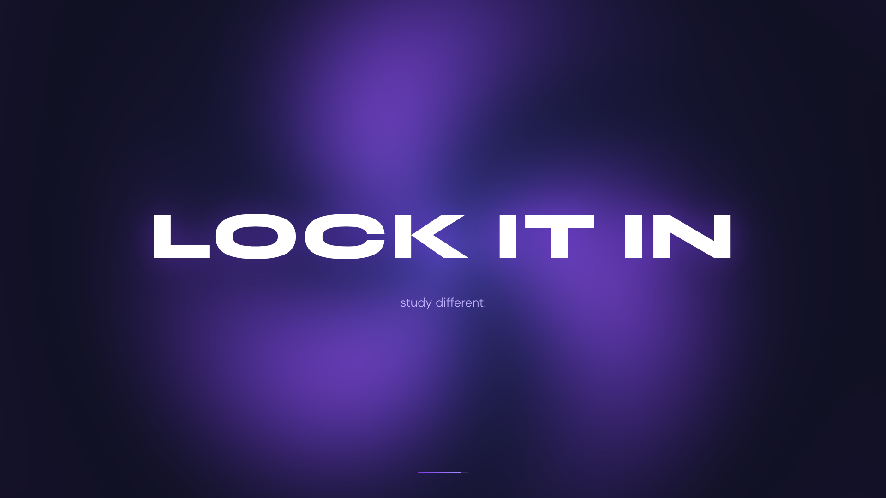

### 2. Landing Page

The landing page is the public entry point. It uses a huge typographic hero, a bold CTA, and a six-tile feature grid to explain the study modes at a glance.

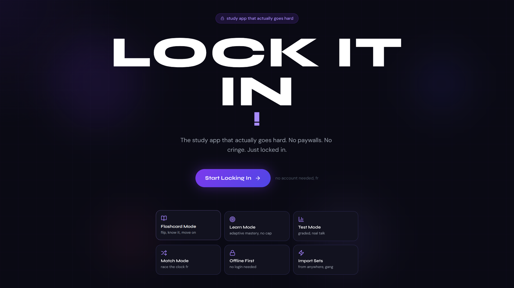

### 3. Main Dashboard

The dashboard is the post-login home screen. It shows the app logo, a greeting, stat cards, tag filters, study set cards, and a floating create button.

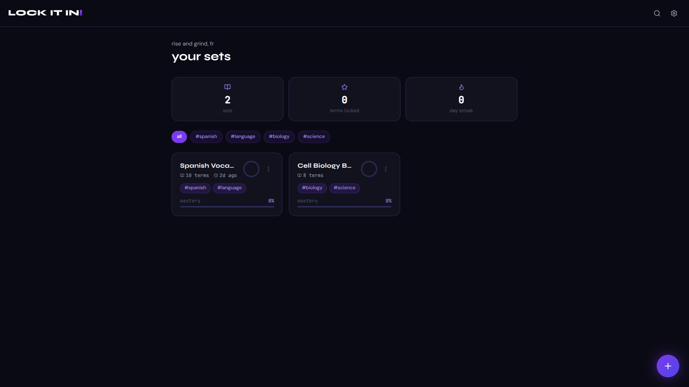

### 4. Set Details Dashboard

The set detail view exposes the selected set title, tags, progress meter, study mode shortcuts, and the list of terms in the set.

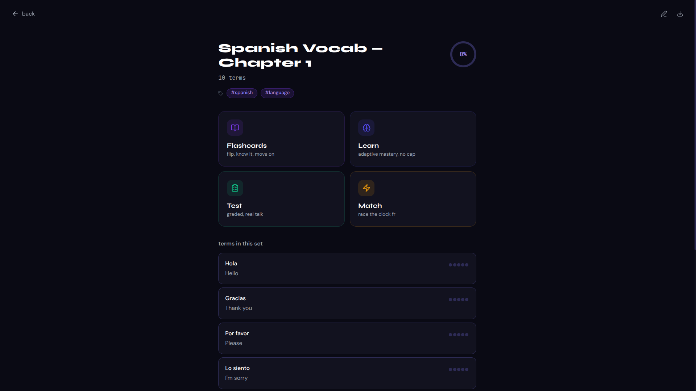

### 5. Flashcard Term View

Flashcard mode centers a single card with a term prompt, flip hint, progress bar, and know/don't-know actions, plus keyboard shortcut guidance.

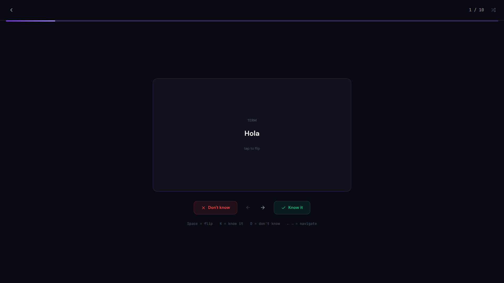

### 6. Test True/False Question

This alternate test question type asks whether a provided definition is correct and gives the user two large judgment buttons.

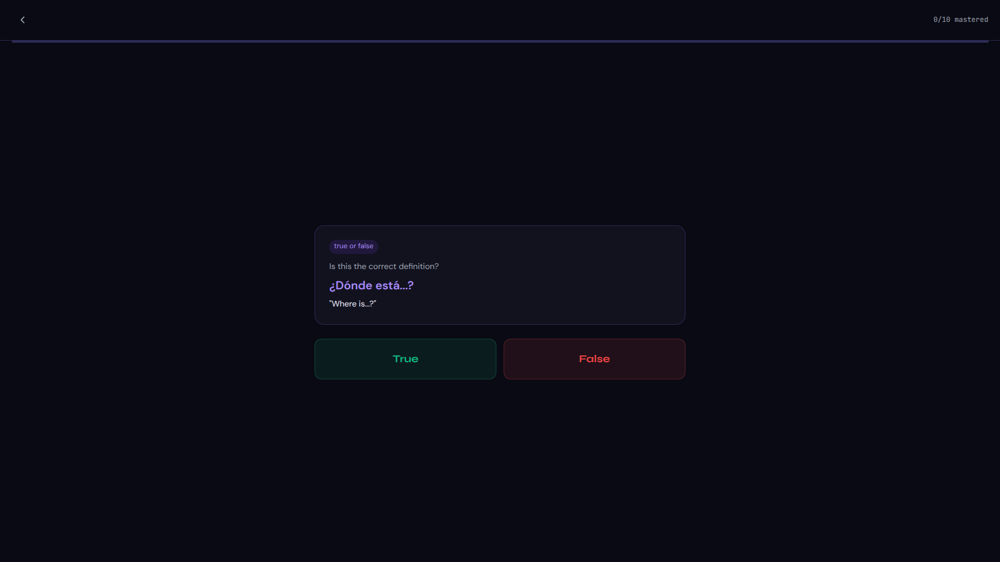

### 7. Learn Mode Multiple Choice

Learn mode uses guided prompts and multiple choice answers to reinforce the correct definition from a set of options.

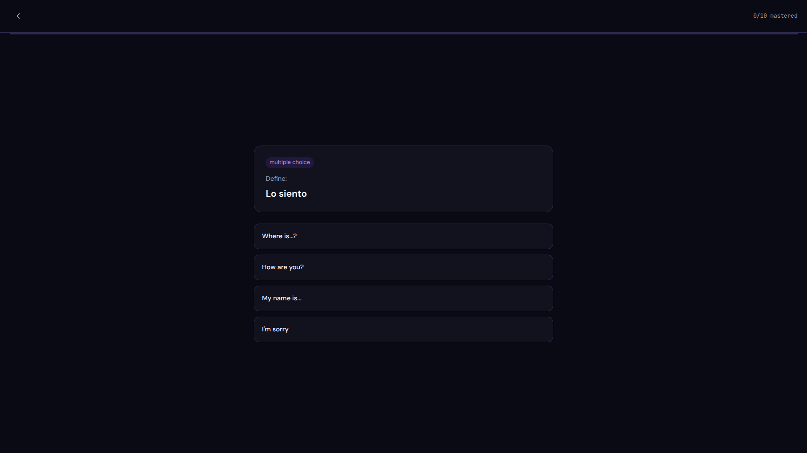

### 8. Test Setup Slider

The test setup screen lets the user choose how many questions to generate before starting the quiz.

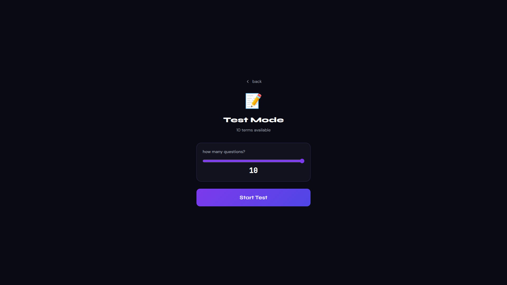

### 9. Test Multiple-Choice List

This test layout presents a stacked quiz flow with a question counter, submit button, and multiple questions shown in sequence.

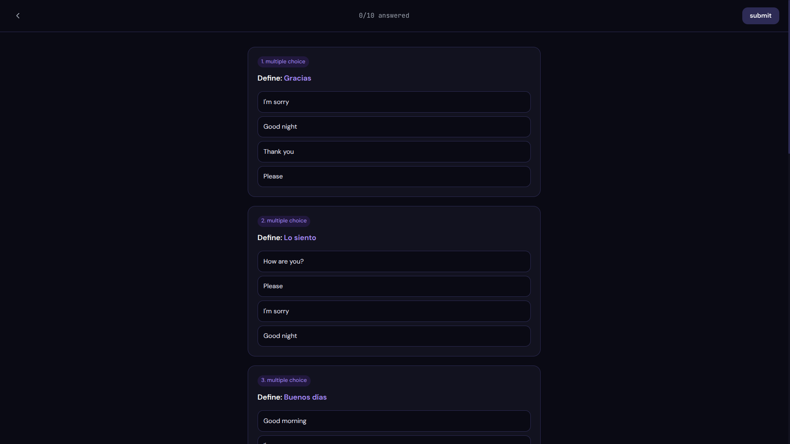

### 10. Match Game Start

The match game starts with a neutral grid and a timer prompt that tells the user to tap a card to begin.

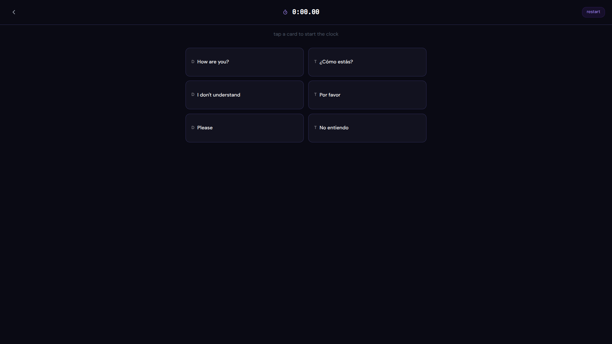

### 11. Match Game Incorrect State

This state shows how incorrect selections are surfaced with red highlighting during the match game.

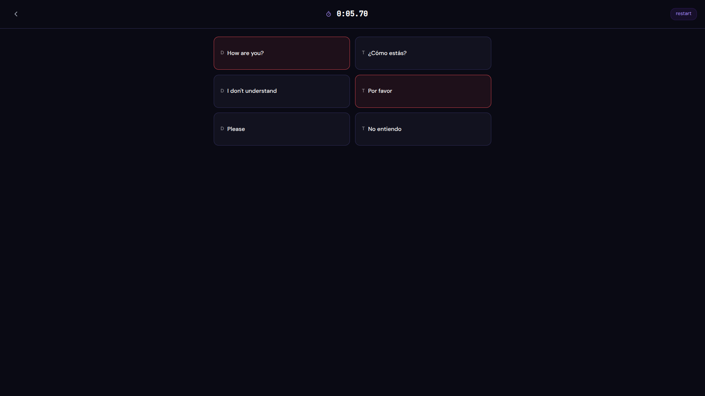

### 12. Match PB Results

When the user sets a new personal best, the results screen celebrates the time with a clear success message and replay CTA.

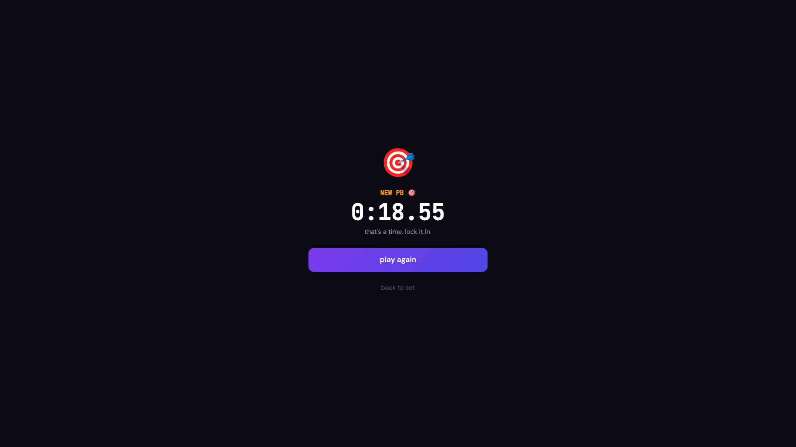

### 13. Create Set Disabled State

This screen shows the create-set flow before the form is complete. The CTA is disabled until enough content is added.

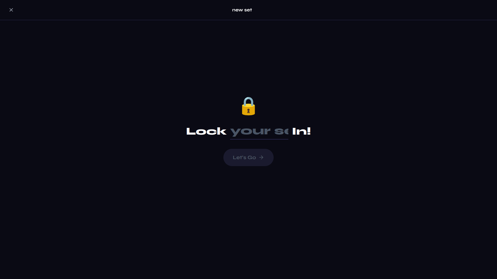

### 14. Create Set Active State

Once the user has entered enough information, the create flow becomes active and the CTA changes to the primary purple button.

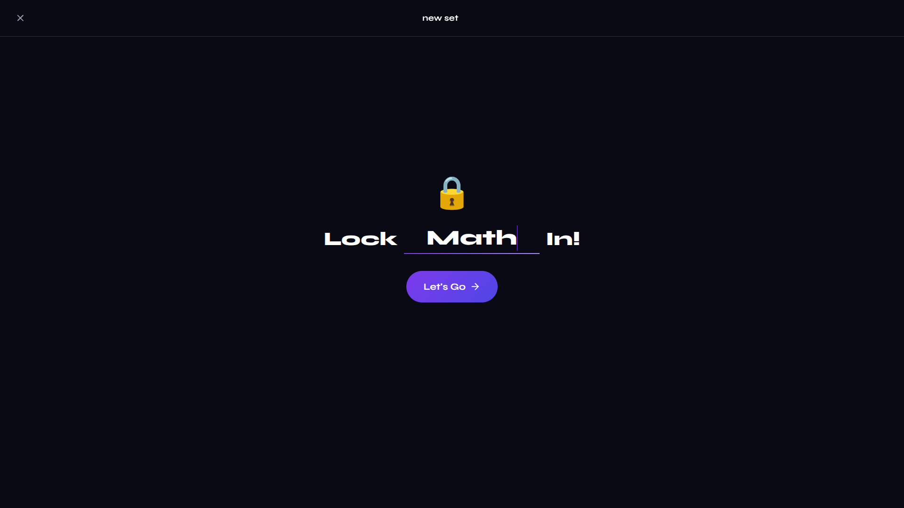

### 15. Create/Edit Form

The edit form includes tag entry, term and definition columns, add-another controls, and a visible readiness counter.

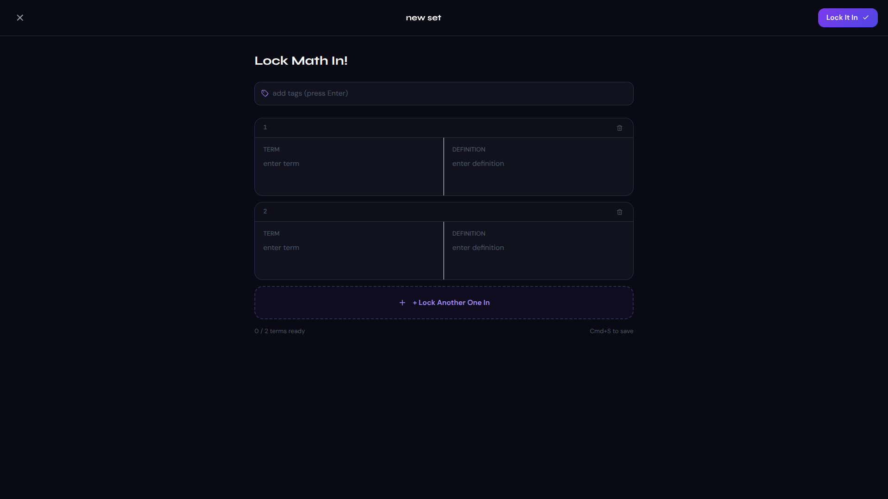

### 16. Error Toast

The toast system uses blunt, conversational copy for validation errors so feedback is visible without feeling formal or generic.

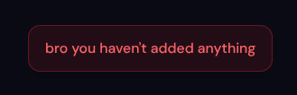

## Asset Guide

The screenshots in `assets/` are intentionally curated to document the app’s major states from first load through study completion.

- `01_splash_screen.png` documents the branded preload screen.
- `02_landing_page.png` documents the public landing page.
- `03_main_dashboard.png` documents the dashboard home state.
- `04_set_details_dashboard.png` documents the set overview screen.
- `05_flashcard_term_view.png` documents the flashcard study screen.
- `06_test_true_false.png` documents the true/false test variant.
- `07_learn_single_mcq.png` documents the learn-mode multiple choice layout.
- `08_test_setup_slider.png` documents the test setup screen.
- `09_test_mcq_list.png` documents the multi-question test list layout.
- `10_match_game_start.png` documents the initial match-game board.
- `11_match_game_incorrect.png` documents the incorrect selection feedback state.
- `12_match_pb_results.png` documents the personal-best results screen.
- `13_create_lock_your_set.png` documents the disabled create-set state.
- `14_create_lock_math_in.png` documents the active create-set state.
- `15_create_edit_form.png` documents the term-entry editor.
- `16_error_bro_toast.png` documents the validation toast.

## Notes On Behavior

- The app uses local storage for onboarding, settings, and progress state.
- Demo data is seeded to make the dashboard feel populated on first entry.
- View transitions are animated so screen changes feel deliberate instead of abrupt.
- The design system is intentionally dark, high contrast, and purple-forward.

## Contributing

If you extend the app, keep the tone, motion, and layout language consistent with the existing product direction. The screenshots in `assets/` are a good reference for spacing, hierarchy, and copy style.
